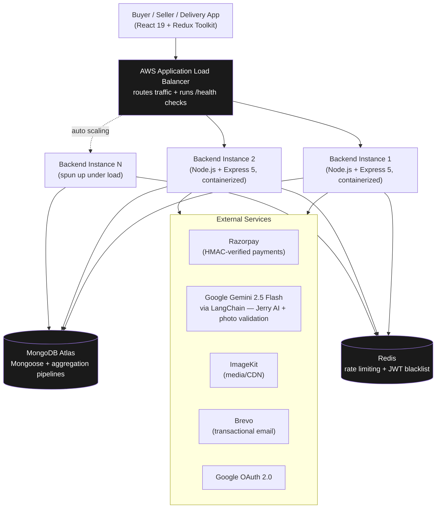

# 🛍️ Luomi Atelier

### A production-grade, auto-scaling luxury fashion e-commerce platform

**Built and deployed on AWS like an actual production system, not a tutorial project.**

[**🌐 Live Demo**](http://luomi-alb-877355459.ap-south-1.elb.amazonaws.com/) · [**📂 Source Code**](https://github.com/Notanormaldev/Luomi)

---

## 📸 Preview

  

  

---

## ⚡ Why This Project Stands Out

Most student MERN projects run on a single Node process and call it done. Luomi is built and hosted the way a real engineering team would ship an e-commerce product — containerized, load balanced, auto-scaling, and instrumented for observability.

It's live right now behind an **AWS Application Load Balancer**, traffic is distributed across **auto-scaling containerized instances**, and the backend is hardened with the same security and resilience patterns used in production fintech and retail systems.

---

## 🏗️ Architecture

**How a request actually flows:** the React app never talks to a single server — it hits the ALB, which health-checks every backend instance and only routes traffic to the ones that are alive. When load spikes, Auto Scaling spins up new containerized instances and the ALB starts routing to them automatically, with zero code changes and zero downtime.

---

## 🧩 Why These Choices (and not the obvious alternative)

A few decisions here were deliberate trade-offs, not defaults:

- **AWS ALB + Auto Scaling instead of Render/Vercel** — Render and Vercel are great, but they hide all the infrastructure decisions. The goal here was to actually *own* the scaling problem: configure health checks, handle instance termination gracefully, and make sure the app behaves correctly when there's more than one backend process running behind a load balancer — which is exactly when most student projects quietly break.

- **Redis-backed token blacklisting instead of just short JWT expiry** — short-lived JWTs alone still leave a window where a "logged out" token is technically still valid until it expires. Blacklisting in Redis makes logout immediate and absolute, which matters for a platform handling real payments.

- **Distributed rate limiting instead of in-memory** — in-memory rate limiting works fine on one server and silently stops working the moment you run two. Since Luomi runs multiple instances behind the ALB by design, the limiter had to be distributed from day one, not patched in later.

- **Gemini 2.5 Flash for Jerry over GPT-4 / Claude** — Flash is fast and cheap enough to power a real-time, always-on shopping assistant without rate-limit anxiety, while still being capable enough for sizing, fit, and budget-based product queries. Jerry also has an offline fallback so a model outage never breaks the shopping flow.

- **Three separate roles (buyer/seller/delivery) instead of a buyer-only flow** — a single-role storefront doesn't actually test order lifecycle, fulfillment, or delivery logistics. Building all three forced real decisions around role-based access control and made the order lifecycle below actually mean something.

---

## 🏗️ Infrastructure & Deployment (AWS)

This isn't "deployed on Render and forgotten." Luomi runs on real cloud infrastructure:

- **Application Load Balancer (ALB)** distributing live traffic across multiple backend instances
- **Auto Scaling** so the platform handles traffic spikes without manual intervention
- **Containerized backend** running in isolated, reproducible environments — no "works on my machine" risk
- **Health check endpoint** (`/health`) wired directly into the ALB so unhealthy instances are automatically pulled out of rotation
- **Graceful shutdown handling** on `SIGTERM` — when AWS scales an instance down, in-flight requests are allowed to finish instead of being dropped mid-checkout
- **Distributed, Redis-backed rate limiting** — because in-memory rate limiting breaks the moment you run more than one instance behind a load balancer, and Luomi runs more than one

This means the platform behaves correctly under real auto-scaling conditions, not just on a single dev server.

---

## 🧠 Engineering Highlights

### Security, the way production APIs are actually secured
- JWT authentication in `httpOnly`, `secure` cookies with **active token blacklisting on logout** via Redis (a logged-out token is dead immediately, not just expired)
- `Helmet.js` enforcing HSTS, clickjacking protection, MIME-sniffing protection, and XSS headers
- Brute-force protected auth routes with stricter, separately-tuned rate limits
- Google OAuth 2.0 alongside traditional email/OTP authentication
- Role-based access control across three completely separate user types — **buyer, seller, and delivery partner**

### Payments that actually work like payments
- Razorpay integration with **HMAC-SHA256 signature verification** on every transaction — no trusting the client, every payment is cryptographically verified server-side
- Automated cleanup job that silently kills abandoned/pending checkouts so stale orders never pollute order history

### AI that's actually doing something useful
- **Jerry**, an in-app AI shopping assistant powered by **LangChain + Google Gemini 2.5 Flash**, answers real product questions (sizing, fit, material, price), gives body-type-based size recommendations, and handles natural language budget queries — with a smart offline fallback if the model is unreachable
- **AI-powered delivery photo validation** using a vision model to verify proof-of-delivery photos automatically, falling back to metadata checks if the model is unavailable

### A real order lifecycle, not a fake "place order" button
Cart → Checkout (COD or Razorpay) → Order confirmation email → Seller marks "Out for Delivery" → stock auto-decremented → delivery partner verifies and uploads proof-of-delivery photo (AI-validated) → buyer and seller both notified at every step via transactional email.

---

## 🛠️ Tech Stack

| Layer | Technology |
|---|---|
| **Backend** | Node.js, Express 5 |
| **Database** | MongoDB Atlas (Mongoose, aggregation pipelines) |
| **Cache & Session Control** | Redis (rate limiting, token blacklisting) |
| **Auth** | JWT + Google OAuth 2.0 + OTP verification |
| **Payments** | Razorpay (signature-verified) |
| **Email** | Brevo transactional email API |
| **Media/CDN** | ImageKit |
| **AI** | LangChain + Google Gemini 2.5 Flash, vision-based photo validation |
| **Frontend** | React 19, Vite, Redux Toolkit, Tailwind CSS v4 |
| **Infrastructure** | AWS (ALB, Auto Scaling, containerized deployment) |

---

## 👤 Roles Supported

- **Buyer** — browse, AI-assisted shopping, cart, checkout, order tracking, wishlist
- **Seller** — product management, order fulfillment, dispatch workflow
- **Delivery Partner** — city-scoped order dashboard, AI-verified proof of delivery

---

## 🔗 Links

- **Live App:** http://luomi-alb-877355459.ap-south-1.elb.amazonaws.com/
- **Repository:** https://github.com/Notanormaldev/Luomi

---

Built end-to-end (backend, frontend, AI, and AWS infrastructure) as a full-stack engineering project.

